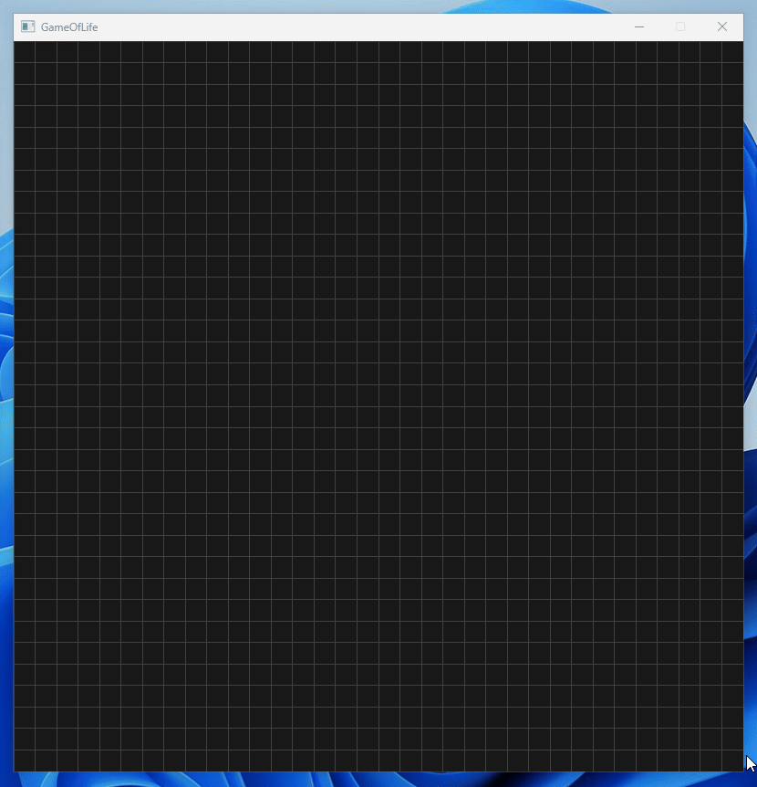

# GameOfLife

This is a simple implementation of Conway's Game Of Life.

## Controls

- Press `G` to toggle playback.
- Press `Space` to increment the game by one step.

## How to Build

Open `GameOfLife.sln` and press `Ctrl+F5` to compile and run the program.
